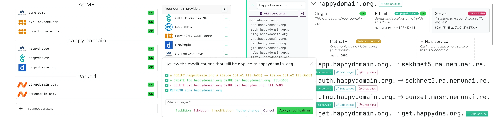

happyDomain
===========

happyDomain is a free web application that centralizes the management of your domain names from different registrars and hosts.



It consists of a HTTP REST API written in Golang (primarily based on https://stackexchange.github.io/dnscontrol/ and https://github.com/miekg/dns) with a nice web interface written with [Svelte](https://svelte.dev/).
It runs as a single stateless Linux binary, backed by a database (currently: LevelDB, more to come soon).

**Features:**

* An ultra fast web interface without compromise
* Multiple domains management
* Support for 44+ DNS providers (including dynamic DNS, RFC 2136) thanks to [DNSControl](https://stackexchange.github.io/dnscontrol/)
* Support for the most recents resource records thanks to [CoreDNS's library](https://github.com/miekg/dns)
* Zone editor with a diff view to review the changes before propagation
* Keep an history of published changes
* Contextual help
* Multiple users with authentication or one user without authtication
* Compatible with external authentication (OpenId Connect or through JWT tokens: Auth0, ...)

**happyDomain is functional but still very much a work in progress: it's a carefully crafted proof of concept that evolves thanks to you!**

Given the diversity of DNS configurations and user needs, we haven't yet identified all the bugs. **If something doesn't work, please don't leave: [tell us what's wrong](https://github.com/happyDomain/happydomain/issues).** We're highly responsive and each reported bug helps us improve the tool for everyone.

[Whether it works for you or not, we need your feedback!](https://feedback.happydomain.org/) What do you think of our approach to simplifying domain name management? Your impressions at this stage help us guide the project according to **your actual expectations**.


Using Docker
------------

We are a Docker sponsored OSS project! Thus you can easily try and/or deploy our app using Docker/podman/kubernetes/...

You can use `docker compose` to launch happyDomain:

```
git clone https://framagit.org/happyDomain/happyDomain.git
cd happyDomain
docker compose up
```

Or directly with the `docker run`:

```
docker run -e HAPPYDOMAIN_NO_AUTH=1 -p 8081:8081 happydomain/happydomain
```

This command will launch happyDomain in a few seconds, for evaluation purposes (no authentication, volatile storage, ...). With your browser, just go to <http://localhost:8081> and enjoy!

In order to deploy happyDomain, check the [Docker image documentation](https://hub.docker.com/r/happydomain/happydomain).


Install from binary
-------------------

Prebuilt binaries are availables at: <https://get.happydomain.org/>

Choose a directory (the latest version available, or `master`) and choose the binary that corresponds to your operating system and CPU architecture.


Use happyDomain
---------------

The binary comes with sane default options to start with.
You can simply launch the following command in your terminal:

```
./happyDomain
```

After some initialization, it should show you:

    Admin listening on ./happydomain.sock
    Ready, listening on :8081

Go to http://localhost:8081/ to start using happyDomain.


### Database configuration

By default, the LevelDB storage engine is used. You can change the storage engine using the option `-storage-engine other-engine`.

The help command `./happyDomain -help` shows you the available engines:

```
    -storage-engine value
    	Select the storage engine between [inmemory leveldb oracle-nosql postgresql] (default leveldb)
```

#### LevelDB

LevelDB is a small embedded key-value store (as SQLite it doesn't require an additional daemon to work).

```
    -leveldb-path string
    	Path to the LevelDB Database (default "happydomain.db")
```

By default, a new directory is created near the binary, called `happydomain.db`. This directory contains the database used by the program.
You can change it to a more meaningful/persistant path.

#### inmemory

Data are stored in memory and lost when service is stopped.

#### PostgreSQL

PostgreSQL support is provided primarily for installations that already have an existing PostgreSQL database infrastructure in place. This allows you to leverage your current database setup, backup procedures, and operational tooling without deploying additional database systems.

happyDomain uses PostgreSQL in a key-value storage mode, storing all data in a single table with `key` and `value` columns. While this works reliably, note that PostgreSQL is not the optimal choice for key-value workloads compared to dedicated key-value stores. If you're deploying from scratch and need scalability beyond LevelDB, consider using a storage backend specifically designed for key-value operations instead.

```
    -postgres-database string
      	PostgreSQL database name (default "happydomain")
    -postgres-host string
      	PostgreSQL server hostname (default "localhost")
    -postgres-password string
      	PostgreSQL password
    -postgres-port int
      	PostgreSQL server port (default 5432)
    -postgres-ssl-mode string
      	PostgreSQL SSL mode (disable, require, verify-ca, verify-full) (default "disable")
    -postgres-table string
      	PostgreSQL table name for key-value storage (default "happydomain_kv")
    -postgres-user string
    	PostgreSQL username (default "happydomain")
```

#### Oracle NoSQL Database

Oracle NoSQL Database is a fully managed cloud service from Oracle Cloud Infrastructure (OCI) that provides on-demand throughput and storage-based provisioning. happyDomain can use it as a scalable, cloud-based storage backend for production deployments.

To use Oracle NoSQL Database, you'll need to have an OCI account with a NoSQL table created. The table should have a primary key field named `key` (string type) and a `value` field (JSON type) to store the data. Authentication uses OCI's IAM with API signing keys.

Configure the following options to connect happyDomain to your Oracle NoSQL Database:

```
    -oci-compartment string
      	OCI compartment ID where the NoSQL database lies
    -oci-fingerprint string
      	OCI user API key fingerprint
    -oci-private-key-file string
      	Path to the OCI private key for the given user
    -oci-region string
      	OCI region where the NoSQL database is located (default "us-phoenix-1")
    -oci-table string
      	Table name where values are stored (default "happydomain")
    -oci-tenancy string
      	OCI tenancy ID where is located the NoSQL database
    -oci-user string
      	OCI user ID accessing the NoSQL database
```

#### DBMS

DBMS as Mysql/Mariadb are no more supported or planned.

### Persistent configuration

The binary will automatically look for some existing configuration files:

* `./happydomain.conf` in the current directory;
* `$XDG_CONFIG_HOME/happydomain/happydomain.conf`;
* `/etc/happydomain.conf`.

Only the first file found will be used.

It is also possible to specify a custom path by adding it as argument to the command line:

```sh
./happyDomain /etc/happydomain/config
```

#### Config file format

Comments line has to begin with #, it is not possible to have comments at the end of a line, by appending # followed by a comment.

Place on each line the name of the config option and the expected value, separated by `=`. For example:

```
storage-engine=leveldb
leveldb-path=/var/lib/happydomain/db/
```

#### Environment variables

It'll also look for special environment variables, beginning with `HAPPYDOMAIN_`.

You can achieve the same as the previous example, with the following environment variables:

```
HAPPYDOMAIN_STORAGE_ENGINE=leveldb
HAPPYDOMAIN_LEVELDB_PATH=/var/lib/happydomain/db/
```

You just have to replace dash by underscore.

#### Need OVH API?

OVH doesn't have simple API key or credentials. It depends on a web flow to retrieve the key.

To be able to initiate the authentication flow, your happyDomain instance need to have a dedicated Application Key.

[Follow those instructions if you need to connect to OVH](https://help.happydomain.org/en/introduction/deploy/ovh).


Building
--------

### Dependencies

In order to build the happyDomain project, you'll need the following dependencies:

* `go`;
* `nodejs` tested with version 22;
* `swag` tested with version 1.16 (can be installed through `go install github.com/swaggo/swag/cmd/swag@latest`).


### Instructions

1. First, you'll need to prepare the frontend, by installing the node modules dependencies:

```
pushd web; npm install; popd
```

2. Then, generate assets files used by Go code:

```
go generate -tags swagger,web ./...
```

3. Finaly, build the Go code:

```
go build -tags swagger,web ./cmd/happyDomain
```

This last command will create a binary `happyDomain` you can use standalone.


Development environment
-----------------------

If you want to contribute to the frontend, instead of regenerating the frontend assets each time you made a modification (with `go generate`), you can use the development tools:

In one terminal, run `happydomain` with the following arguments:

```
./happyDomain -dev http://127.0.0.1:5173
```

In another terminal, run the node part:

```
cd web; npm run dev
```

With this setup, static assets integrated inside the go binary will not be used, instead it'll forward all requests for static assets to the node server, that do dynamic reload, etc.
