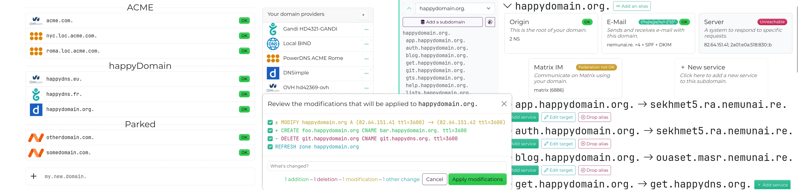

happyDomain
===========

[](./LICENSE)
[](https://hub.docker.com/r/happydomain/happydomain)
[](https://matrix.to/#/%23happyDNS:matrix.org)
[](https://try.happydomain.org/)
[](https://github.com/happyDomain/happydomain)
[](https://github.com/happyDomain/happydomain/releases)

> **中文译者：** [exyone](https://www.exyone.me/) · [exyone.dev@icloud.com](mailto:exyone.dev@icloud.com)

happyDomain 是一款免费的 Web 应用，可集中管理来自不同注册商和托管商的域名。



**官网：** [happydomain.org](https://www.happydomain.org/) | **演示：** [try.happydomain.org](https://try.happydomain.org/)

由于软件架构限制，当前 happyDomain 仅支持简体中文，繁体中文用户请安装浏览器扩展进行简繁转换。造成困扰，敬请谅解。

它由 Golang 编写的 HTTP REST API（主要基于 [DNSControl](https://dnscontrol.org/) 和 [CoreDNS 库](https://github.com/miekg/dns)）与 [Svelte](https://svelte.dev/) 构建的精美 Web 界面组成。作为单一无状态的 Linux 二进制文件运行，支持多种数据库后端。

目录
----

- [主要特性](#主要特性)
- [使用 Docker 快速开始](#使用-docker-快速开始)
- [从二进制文件安装](#从二进制文件安装)
- [配置说明](#使用-happydomain)
- [从源码构建](#从源码构建)
- [开发环境](#开发环境)
- [参与贡献](#参与贡献)
- [AI 使用声明](#ai-使用声明)
- [许可证](#许可证)


主要特性
--------

* 高性能 Web 界面，响应迅速
* 多域名统一管理
* 支持 60+ DNS 提供商（含动态 DNS、RFC 2136），得益于 [DNSControl](https://dnscontrol.org/)
* 支持最新资源记录类型，得益于 [CoreDNS 库](https://github.com/miekg/dns)
* 区域编辑器支持差异对比，部署前轻松审查变更
* 保留部署变更历史记录
* 上下文帮助
* 支持多用户认证或单用户无认证模式
* 兼容外部认证（OpenID Connect 或 JWT 令牌：Auth0 等）

**happyDomain 已可投入使用，但仍需不断完善：这是一个精心打造的概念验证版本，您的反馈将助力其不断进化！**

鉴于 DNS 配置和用户需求的多样性，我们尚未发现所有潜在问题。**若遇问题，请勿离去：[向我们反馈问题所在](https://github.com/happyDomain/happydomain/issues)。** 我们响应迅速，每个报告的 bug 都能帮助改进工具，惠及众人。

[无论使用体验如何，我们都期待您的反馈！](https://feedback.happydomain.org/) 您如何看待我们简化域名管理的方式？您的初步印象有助于我们根据**您的实际期望**来指引项目方向。


使用 Docker 快速开始
--------------------

我们是由 Docker 赞助的开源项目！因此您可以轻松使用 Docker/Podman/Kubernetes 等容器平台来试用或部署应用。

使用 `docker compose` 启动 happyDomain：

```bash
git clone https://framagit.org/happyDomain/happyDomain.git
cd happyDomain
docker compose up
```

或直接使用 `docker run`：

```bash
docker run -e HAPPYDOMAIN_NO_AUTH=1 -p 8081:8081 happydomain/happydomain
```

此命令将在数秒内启动 happyDomain，用于评估测试（无认证、临时存储等）。使用浏览器访问 <http://localhost:8081> 即可体验！

部署 happyDomain，请查阅 [Docker 镜像文档](https://hub.docker.com/r/happydomain/happydomain)。


从二进制文件安装
----------------

预编译二进制文件下载地址：<https://get.happydomain.org/>

选择目录（最新版本或 `master` 分支），然后选择与您的操作系统和 CPU 架构对应的二进制文件。


使用 happyDomain
----------------

二进制文件附带合理的默认配置，可直接启动。在终端中运行以下命令即可：

```bash
./happyDomain
```

初始化完成后，应显示以下信息：

    Admin listening on ./happydomain.sock
    Ready, listening on :8081

访问 http://localhost:8081/ 开始使用 happyDomain。


### 数据库配置

默认使用 LevelDB 存储引擎。可使用 `-storage-engine` 选项更改存储引擎。

运行 `./happyDomain -help` 查看可用存储引擎：

```
    -storage-engine value
        在 [inmemory leveldb oracle-nosql postgresql] 中选择存储引擎 (默认 leveldb)
```

#### LevelDB

LevelDB 是轻量级嵌入式键值存储（类似 SQLite，无需额外守护进程）。

```
    -leveldb-path string
        LevelDB 数据库路径 (默认 "happydomain.db")
```

默认在二进制文件所在目录创建 `happydomain.db` 目录。可更改为更有意义或更持久的路径。

#### inmemory

数据存储于内存中，服务停止后数据即丢失。

#### PostgreSQL

PostgreSQL 支持主要面向已部署 PostgreSQL 数据库基础设施的环境。这允许您利用现有数据库设置、备份流程和运维工具，无需部署额外数据库系统。

happyDomain 以键值存储模式使用 PostgreSQL，将所有数据存储在包含 `key` 和 `value` 列的单张表中。虽然可行，但请注意，与专用键值存储相比，PostgreSQL 并非键值工作负载的最佳选择。若从头部署且需超出 LevelDB 的可扩展性，请考虑使用专为键值操作设计的存储后端。

```
    -postgres-database string
        PostgreSQL 数据库名称 (默认 "happydomain")
    -postgres-host string
        PostgreSQL 服务器主机名 (默认 "localhost")
    -postgres-password string
        PostgreSQL 密码
    -postgres-port int
        PostgreSQL 服务器端口 (默认 5432)
    -postgres-ssl-mode string
        PostgreSQL SSL 模式 (disable, require, verify-ca, verify-full) (默认 "disable")
    -postgres-table string
        键值存储的 PostgreSQL 表名 (默认 "happydomain_kv")
    -postgres-user string
        PostgreSQL 用户名 (默认 "happydomain")
```

#### Oracle NoSQL Database

Oracle NoSQL Database 是来自 Oracle Cloud Infrastructure (OCI) 的全托管云服务，提供按需吞吐量和高可用的存储配置。happyDomain 可将其作为可扩展的云端存储后端用于生产部署。

使用 Oracle NoSQL Database 需拥有 OCI 账户并创建 NoSQL 表。表需包含主键字段 `key`（字符串类型）和 `value` 字段（JSON 类型）存储数据。认证使用 OCI 的 IAM 和 API 签名密钥。

配置以下选项连接 happyDomain 至 Oracle NoSQL Database：

```
    -oci-compartment string
        NoSQL 数据库所在的 OCI 隔间 ID
    -oci-fingerprint string
        OCI 用户 API 密钥指纹
    -oci-private-key-file string
        给定用户的 OCI 私钥文件路径
    -oci-region string
        NoSQL 数据库所在的 OCI 区域 (默认 "us-phoenix-1")
    -oci-table string
        存储值的表名 (默认 "happydomain")
    -oci-tenancy string
        NoSQL 数据库所在的 OCI 租户 ID
    -oci-user string
        访问 NoSQL 数据库的 OCI 用户 ID
```

#### 数据库管理系统

MySQL/MariaDB 等 DBMS 已不再支持，亦无相关计划。


### 持久化配置

二进制文件会自动查找以下配置文件：

* 当前目录下的 `./happydomain.conf`；
* `$XDG_CONFIG_HOME/happydomain/happydomain.conf`；
* `/etc/happydomain.conf`。

仅使用找到的第一个文件。

也可通过命令行参数指定自定义路径：

```sh
./happyDomain /etc/happydomain/config
```

#### 配置文件格式

注释行必须以 `#` 开头，不支持行尾注释。

每行放置配置选项名称和期望值，用 `=` 分隔。例如：

```
storage-engine=leveldb
leveldb-path=/var/lib/happydomain/db/
```

#### 环境变量

还会查找以 `HAPPYDOMAIN_` 开头的特殊环境变量。

使用以下环境变量可达到与上述示例相同的效果：

```
HAPPYDOMAIN_STORAGE_ENGINE=leveldb
HAPPYDOMAIN_LEVELDB_PATH=/var/lib/happydomain/db/
```

只需将短横线替换为下划线即可。

#### 需要 OVH API？

OVH 没有简单的 API 密钥或凭据，需通过 Web 流程获取密钥。

启动认证流程，happyDomain 实例需配备专用应用程序密钥。

[连接 OVH，请按以下说明操作](https://help.happydomain.org/en/introduction/deploy/ovh)。


从源码构建
----------

### 依赖项

构建 happyDomain 项目需具备以下依赖项：

* `go`；
* `nodejs`，已测试版本 22；
* `swag`，已测试版本 1.16（可通过 `go install github.com/swaggo/swag/cmd/swag@latest` 安装）。


### 构建步骤

1. 首先准备前端，安装 node 模块依赖：

```bash
pushd web; npm install; popd
```

2. 然后生成 Go 代码使用的资源文件：

```bash
go generate -tags swagger,web ./...
```

3. 最后编译 Go 代码：

```bash
go build -tags swagger,web ./cmd/happyDomain
```

此命令将创建独立二进制文件 `happyDomain`。


开发环境
--------

若要为前端做贡献，而非每次修改后都重新生成前端资源（使用 `go generate`），可使用开发工具：

一个终端中使用以下参数运行 happydomain：

```bash
./happyDomain -dev http://127.0.0.1:5173
```

另一终端运行 node 部分：

```bash
cd web; npm run dev
```

此设置不使用集成到 Go 二进制文件中的静态资源，而是将所有静态资源请求转发至 node 服务器，实现动态重载等功能。


参与贡献
--------

欢迎参与贡献！您可以通过以下方式帮助我们：

- **报告问题：** 在您喜欢的代码托管平台提交 Issue：[GitHub](https://github.com/happyDomain/happydomain/issues)、[GitLab](https://gitlab.com/happyDomain/happydomain/-/issues)、[Framagit](https://framagit.org/happyDomain/happydomain/-/issues)、[Codeberg](https://codeberg.org/happyDomain/happyDomain/issues)，我们响应迅速。
- **分享反馈：** [告诉我们您的想法](https://feedback.happydomain.org/)，您的意见将指引项目发展方向。


AI 使用声明
-----------

关于项目开发中 AI 的使用，我们收到过一些询问。我们的项目涉及域名管理，这是一个敏感领域，错误可能导致真实的服务中断，因此有必要说明 AI 在开发过程中的使用方式。

AI 作为辅助工具用于：

- 代码质量验证和漏洞搜索
- 清理和改进文档、注释和代码
- 开发过程中的辅助
- 人工审查后对 PR 和提交的二次检查

AI 不用于：

- 编写完整的功能或组件
- "氛围编程"（vibe coding）方式
- 未经人工逐行验证的代码
- 没有测试的代码

项目具备：

- 带有测试和代码检查的 CI/CD 流水线自动化，确保代码质量
- 经验丰富的开发者审核

因此 AI 只是开发者的助手和提高生产力的工具，确保代码质量。实际工作由开发者完成。

我们不区分糟糕的人工代码和 AI 氛围代码。任何代码要合并都有严格要求，以保持代码库的可维护性。即使是人工手写的代码，也不能保证被合并。氛围代码不被允许，此类 PR 会被拒绝。

*灵感来源于 [Databasus AI 声明](https://github.com/databasus/databasus#ai-disclaimer)。*


许可证
------

happyDomain 采用 [GNU Affero General Public License v3.0](./LICENSE) (AGPL-3.0) 许可证。

同时提供商业许可证，如有需要请联系我们。
