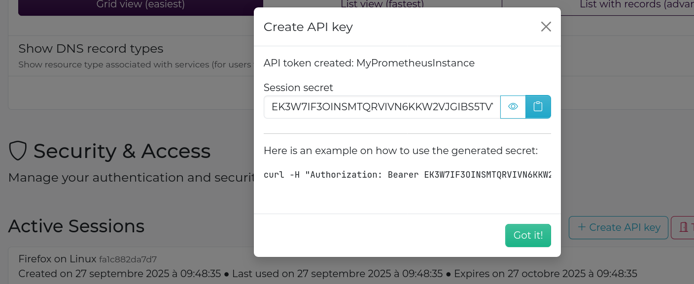
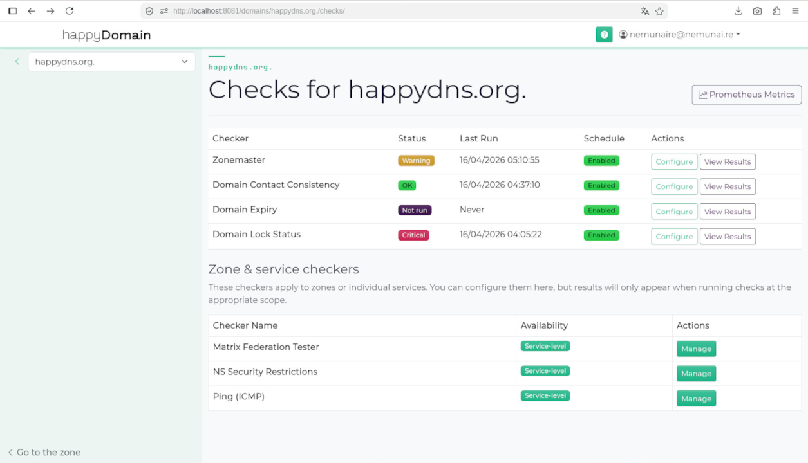

# Scraping happyDomain checker metrics with Prometheus

happyDomain exposes check results as time-series metrics that Prometheus can
scrape directly. This lets you alert on DNS health checks, track trends over
time, and correlate domain health with the rest of your infrastructure.

> **Scope of this document:** user-facing metrics from the checker subsystem.
> The admin-socket `/metrics` endpoint (happyDomain internal instrumentation)
> is covered separately in [metrics.md](metrics.md).

---

## Getting started

### 1. Create an API token

The metrics endpoints require authentication. You need a long-lived API token
(not your login session).

1. Log in to happyDomain.
2. Go to the **Account** page (top-right user menu).
3. Scroll down to the **Security & Access** section.
4. Click **Create API key**.
5. Give the key a descriptive name (e.g. `prometheus-scraper`).
6. Click **Create API key** in the modal.
7. **Copy the secret immediately** (it is shown only once).



The secret is used as a Bearer token in every request:

```
Authorization: Bearer <your-secret-here>
```

### 2. Verify manually

Before configuring Prometheus, confirm that the endpoint is reachable and
returns Prometheus-formatted data:

```bash
curl -s \
  -H "Authorization: Bearer <your-secret>" \
  -H "Accept: text/plain" \
  https://happydomain.example.com/api/checkers/metrics
```

You should see lines like:

```
# HELP dns_rtt_seconds unit: s
# TYPE dns_rtt_seconds untyped
dns_rtt_seconds{...} 0.042 1744800000000
```

> **Format selection:** the API returns JSON by default. Add
> `Accept: text/plain` (or `Accept: application/openmetrics-text`) to receive
> Prometheus text exposition format 0.0.4. Prometheus itself sends the right
> header automatically when you use the `params` and `headers` scrape options
> shown below.

### 3. Minimal Prometheus scrape config

```yaml
scrape_configs:
  - job_name: happydomain_checks
    metrics_path: /api/checkers/metrics
    scheme: https
    authorization:
      type: Bearer
      credentials: <your-secret>
    params:
      # Not needed; Prometheus sends Accept: application/openmetrics-text
      # by default and the API honours it.
    static_configs:
      - targets:
          - happydomain.example.com
```

That's it. Prometheus will now scrape all check metrics for your account on
every evaluation interval.

---

## Available endpoints

All endpoints are under `/api` and require `Authorization: Bearer <token>`.

### All user metrics

```
GET /api/checkers/metrics
```

Returns metrics from recent executions of **every checker across all your
domains**. This is the broadest scrape target, useful when you want a single
job covering everything.

| Query parameter | Default | Description |
|---|---|---|
| `limit` | `100` | Maximum number of recent executions to include. |

```bash
curl -s \
  -H "Authorization: Bearer <token>" \
  -H "Accept: text/plain" \
  "https://happydomain.example.com/api/checkers/metrics?limit=200"
```

---

### Domain metrics

```
GET /api/domains/{domain}/checkers/metrics
```

Returns metrics for **all checkers on a single domain**, including checkers
running on its services. `{domain}` is your domain FQDN (e.g.
`example.com`) or its internal identifier; both are accepted.

| Query parameter | Default | Description |
|---|---|---|
| `limit` | `100` | Maximum number of recent executions to include. |

```bash
curl -s \
  -H "Authorization: Bearer <token>" \
  -H "Accept: text/plain" \
  "https://happydomain.example.com/api/domains/example.com/checkers/metrics"
```

Prometheus config for per-domain scraping:

```yaml
scrape_configs:
  - job_name: happydomain_example_com
    metrics_path: /api/domains/example.com/checkers/metrics
    scheme: https
    authorization:
      type: Bearer
      credentials: <your-secret>
    static_configs:
      - targets:
          - happydomain.example.com
```



---

### Per-checker metrics (domain level)

```
GET /api/domains/{domain}/checkers/{checkerId}/metrics
```

Returns metrics for **one specific checker on a domain**. Use this when you
want fine-grained scrape intervals or separate Prometheus jobs per checker
type.

`{checkerId}` is the checker identifier (e.g. `dnssec`, `mx_reachability`).
The easiest way to obtain the exact URL is the **Prometheus Metrics** button
on the checker configuration page (visible when the checker produces metrics).

| Query parameter | Default | Description |
|---|---|---|
| `limit` | `100` | Maximum number of recent executions to include. |

```bash
curl -s \
  -H "Authorization: Bearer <token>" \
  -H "Accept: text/plain" \
  "https://happydomain.example.com/api/domains/example.com/checkers/dnssec/metrics"
```

---

### Per-checker metrics (service level)

```
GET /api/domains/{domain}/zone/{zoneId}/{subdomain}/services/{serviceId}/checkers/{checkerId}/metrics
```

Returns metrics for **one specific checker on a DNS service** (a structured
record group, e.g. an MX configuration or an SPF record).

The URL for a service-level checker can be copied from the **Prometheus
Metrics** button on the service's checker configuration page.

| Path segment | Description |
|---|---|
| `{domain}` | Domain FQDN or identifier |
| `{zoneId}` | Zone snapshot identifier (opaque string) |
| `{subdomain}` | Relative owner name within the zone (e.g. `@`, `mail`) |
| `{serviceId}` | Service identifier (opaque string) |
| `{checkerId}` | Checker identifier |

```bash
curl -s \
  -H "Authorization: Bearer <token>" \
  -H "Accept: text/plain" \
  "https://happydomain.example.com/api/domains/example.com/zone/<zoneId>/@/services/<serviceId>/checkers/spf_policy/metrics"
```

---

### Single-execution metrics

```
GET /api/domains/{domain}/checkers/{checkerId}/executions/{executionId}/metrics
GET /api/domains/{domain}/zone/{zoneId}/{subdomain}/services/{serviceId}/checkers/{checkerId}/executions/{executionId}/metrics
```

Returns metrics from **one specific execution run**. This is not typically
used for Prometheus scraping (the data is historical and does not change after
the execution completes); it is more useful for debugging or one-off
inspections.

```bash
curl -s \
  -H "Authorization: Bearer <token>" \
  -H "Accept: text/plain" \
  "https://happydomain.example.com/api/domains/example.com/checkers/dnssec/executions/<executionId>/metrics"
```

---

## Multi-domain Prometheus configuration

To scrape several domains with a single Prometheus job, use
`relabel_configs` to build the path dynamically from a label:

```yaml
scrape_configs:
  - job_name: happydomain_domains
    scheme: https
    authorization:
      type: Bearer
      credentials: <your-secret>
    metrics_path: /api/checkers/metrics   # fallback; overridden per target
    relabel_configs:
      - source_labels: [__address__]
        regex: (.+)@(.+)
        target_label: __metrics_path__
        replacement: /api/domains/$1/checkers/metrics
      - source_labels: [__address__]
        regex: .+@(.+)
        target_label: __address__
        replacement: $1
      - source_labels: [domain]
        target_label: domain
    static_configs:
      - targets:
          - example.com@happydomain.example.com
          - otherdomain.net@happydomain.example.com
        labels:
          instance: happydomain.example.com
```

Each target encodes `domain@host`; the relabel rules split them into the
correct `__metrics_path__` and `__address__`.

---

## Security considerations

- **Treat the API token like a password.** It grants read access to all check
  metrics associated with your account.
- Use a dedicated token for each scraper. You can revoke individual tokens from
  the **Security & Access** page without affecting your login session.
- Prefer HTTPS so the `Authorization` header is not transmitted in the clear.
- The metrics endpoints return only aggregated numeric values; they do not
  expose DNS zone content, provider credentials, or other sensitive
  configuration.
